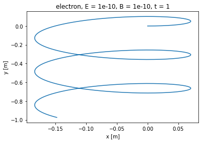
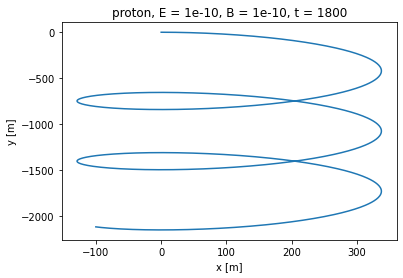
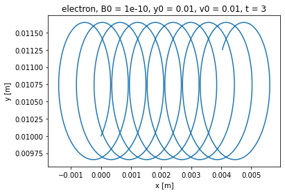
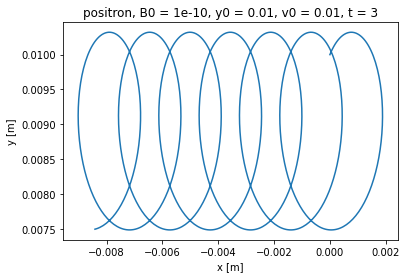

### Exercise 1

We observe ExB drift. If we set the direction of electric field as E ~ (1, 0, 0) and direction of magnetic field as B ~ (0, 0, 1), we see a drift in direction (0, -1, 0) (negative y-axis) for both electron and positron.

### Exercise 2

Electron:

</img>

Amplitude of oscillation: ~ 0.25 m, drift velocity: ~1 m/s

Proton:

</img>

Amplitude of oscillation: ~ 350 m, drift velocity: ~1 m/s

To see a comparable trajectory, we need to increase the timescale from 1 second for electron to roughly 1800 seconds for proton. This is pretty close to the ratio of mass of proton and electron (one can see that this makes sense after looking at the ODEs).

Comparison of the amplitude of oscillation shows that the ratio of oscillation matches the ratio of particles' mass. The drift velocity seems to be the same for both particles

### Exercise 3

Electron:

</img>

Positron:

</img>

The electron drifts in the positive direction of the x-axis, the positron drifts the opposite way. This agrees with the theory.

### Exercise 4

General formula for magnetic field produced by a magnetic dipole moment in Cartesian coordinate can be found here: [https://en.wikipedia.org/wiki/Magnetic_dipole#External_magnetic_field_produced_by_a_magnetic_dipole_moment](https://en.wikipedia.org/wiki/Magnetic_dipole#External_magnetic_field_produced_by_a_magnetic_dipole_moment)

Using that formula, we can see that to produce a magnetic field of *3.12e-5* T at the equator, we need a magnetic dipole of *8.1e22* A m2.

### Exercise 5

First component of motion with the smallest period is the gyration of the particle. Second component is oscillation between Earth's poles. Third component is slow motion around Earth (around the magnetic dipole axis). 

### Exercise 6

Assuming we still work with the 50 MeV proton, I found that with initial distance of 7 Earth radii, the proton is still bound, but the trajectory is be chaotic. With a distance of 8.5 Earth radii, the proton breaks away.

If we start lowering initial altitude of the proton, it begins to touch the Earth's surface when starting at about 1.19 Earth radii high.

